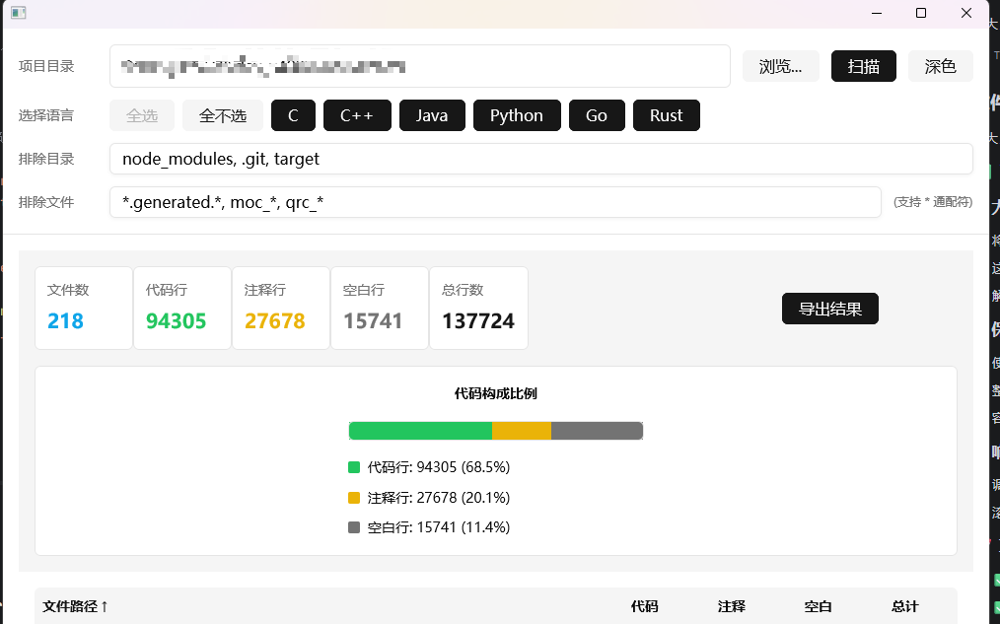

# C/C++ 代码行统计工具 (cc_loc_tool)

一个使用 Rust 语言开发的 C/C++ 代码行统计工具，提供友好的 GUI 界面，支持快速扫描、统计和分析 C/C++ 项目的代码行、注释行和空白行。

## 功能特性

- 📁 **目录扫描**：支持扫描指定目录下的所有支持的源代码文件
- 📊 **详细统计**：分别统计代码行、注释行、空白行的数量
- ⚙️ **灵活过滤**：支持排除指定目录和文件（支持通配符 *）
- 📈 **结果排序**：可按文件路径、代码行、注释行等多维度排序
- 🎨 **友好界面**：使用现代化 GUI 框架，直观展示统计结果
- 🌐 **编码支持**：自动识别 UTF-8 和 GBK 编码的文件
- 🌍 **多语言支持**：支持 C, C++, Java, Python, Go, Rust 等多种编程语言
- 💾 **配置保存**：自动保存和加载用户设置（目录路径、排除规则、语言选择）
- 📤 **导出功能**：支持导出统计结果到 CSV, JSON, HTML 格式
- 🖥️ **命令行界面**：提供 CLI 版本，支持批量处理和自动化
- ⚡ **并行扫描**：使用多线程并行处理，提高大项目扫描速度
- 📊 **进度显示**：扫描过程中实时显示进度条和处理文件数
- 🌓 **深色主题**：支持浅色/深色主题切换，保护眼睛
- 📱 **响应式布局**：优化不同屏幕尺寸下的界面显示
- 📊 **统计图表**：使用进度条样式可视化代码构成比例

## 界面截图



界面展示了项目的主要功能：
- 项目目录选择和浏览
- 支持的编程语言选择
- 目录和文件过滤配置
- 代码构成比例可视化（进度条图表）
- 详细的文件列表统计结果
- 深色/浅色主题切换功能
- 结果导出功能

## 支持的文件类型

### C/C++
- 源代码文件：`.c`, `.cc`, `.cpp`, `.cxx`
- 头文件：`.h`, `.hpp`, `.hxx`
- 内联文件：`.inl`

### Java
- 源代码文件：`.java`

### Python
- 源代码文件：`.py`

### Go
- 源代码文件：`.go`

### Rust
- 源代码文件：`.rs`

## 技术栈

- **语言**：Rust 2024
- **GUI 框架**：gpui
- **依赖管理**：Cargo
- **文件系统**：walkdir
- **错误处理**：anyhow
- **编码处理**：encoding_rs
- **配置管理**：toml
- **并发处理**：rayon
- **数据序列化**：serde_json
- **CSV 导出**：csv
- **HTML 处理**：html-escape
- **日期处理**：chrono
- **系统目录**：dirs

## 安装与运行

### 环境要求

- Rust 1.75+（推荐使用最新稳定版）

### 编译与运行

```bash
# 克隆项目
git clone <项目地址>
cd cc_loc_tool

# 编译并运行
cargo run
```

## 使用说明

### GUI 界面

1. **选择目录**：点击「浏览...」按钮选择要扫描的项目目录
2. **选择语言**：勾选要统计的编程语言（支持多语言同时统计）
3. **配置过滤**：
   - 在「排除目录」输入框中填写要排除的目录名，用逗号或分号分隔
   - 在「排除文件」输入框中填写要排除的文件名（支持通配符 *）
4. **开始扫描**：点击「扫描」按钮开始统计，实时显示进度
5. **查看结果**：扫描完成后查看统计摘要和详细文件列表
6. **排序结果**：点击表格表头可按对应列排序
7. **导出结果**：点击「导出结果」按钮选择导出格式和路径

### 命令行界面 (CLI)

```bash
# 编译 CLI 版本
cargo build --bin cc_loc_cli

# 基本用法
cc_loc_cli <目录路径>

# 示例
cc_loc_cli ./my_project

# 排除指定目录和文件
cc_loc_cli -d ./my_project -e build,target -f moc_*,*.generated.cpp

# 仅统计特定语言
cc_loc_cli -d ./my_project -l C++,Java,Python

# 导出结果到文件
cc_loc_cli -d ./my_project -o results.csv -t csv

# 查看帮助信息
cc_loc_cli --help
```

**命令行选项：**
- `-d, --directory`：要扫描的目录路径
- `-e, --exclude-dirs`：要排除的目录列表，用逗号或分号分隔
- `-f, --exclude-files`：要排除的文件模式，用逗号或分号分隔
- `-l, --languages`：要扫描的编程语言，用逗号或分号分隔（支持：C, C++, Java, Python, Go, Rust）
- `-o, --output`：导出结果的文件路径
- `-t, --format`：导出格式（csv, json, html）
- `-h, --help`：显示帮助信息
- `-v, --version`：显示版本信息

## 默认排除项

### 目录
- `build`, `target`, `node_modules`, `.git`
- `cmake-build-debug`, `cmake-build-release`
- `GeneratedFiles`, `QtAwesome`, `grpc`, `Dependentlibs`

### 文件
- `moc_*`, `ui_*`, `qrc_*`, `pch*`
- `*.generated.cpp`, `qcustomplot.*`

## 项目结构

```
cc_loc_tool/
├── src/
│   ├── main.rs              # GUI 程序入口
│   ├── cli_main.rs          # CLI 程序入口
│   ├── cli.rs               # 命令行界面实现
│   ├── config.rs            # 配置文件处理
│   ├── export.rs            # 导出功能实现
│   ├── loc/                 # 代码统计核心模块
│   │   ├── counter.rs       # 文件行统计逻辑
│   │   ├── scanner.rs       # 目录扫描逻辑
│   │   └── mod.rs           # 模块导出
│   └── ui/                  # UI 界面模块
│       ├── state.rs         # 状态管理
│       ├── view.rs          # 界面渲染
│       └── mod.rs           # 模块导出
├── Cargo.toml               # 项目配置和依赖
└── Cargo.lock               # 依赖版本锁定
```

## 核心功能实现

### 代码行统计算法

1. **文件编码检测**：优先尝试 UTF-8 编码，失败则回退到 GBK 编码
2. **行类型识别**：
   - 空白行：仅包含空格或制表符的行
   - 注释行：以 `//` 开头或在 `/* */` 块内的行
   - 代码行：除上述两种类型外的行
3. **块注释处理**：正确处理跨多行的 `/* */` 注释

### 目录扫描算法

1. **递归遍历**：使用 walkdir 库递归遍历目录
2. **文件过滤**：
   - 基于文件扩展名识别 C/C++ 文件
   - 排除隐藏目录（以 . 开头）
   - 应用用户指定的排除规则
3. **并发优化**：在后台线程执行扫描，不阻塞 UI

## 性能特点

- **高效扫描**：使用 Rust 语言的高性能特性，快速处理大量文件
- **内存友好**：逐行读取文件内容，避免一次性加载大文件
- **UI 响应**：扫描过程中 UI 保持响应状态

## 下一步计划

### 功能增强
- [x] 支持更多编程语言（Java、Python、Go、Rust 等）
- [x] 配置文件支持（自动保存和加载用户设置）
- [x] 增加导出功能（CSV、JSON、HTML）
- [ ] 提供项目分析报告生成
- [ ] 增加代码复杂度分析
- [x] 支持命令行界面 (CLI)

### 性能优化
- [x] 实现并行扫描，提高大项目处理速度
- [x] 优化内存使用，支持处理超大型项目
- [ ] 增加缓存机制，避免重复扫描

### UI 改进
- [x] 增加进度条显示扫描进度
- [ ] 支持深色/浅色主题切换
- [ ] 提供文件预览功能
- [ ] 增加统计图表可视化

## 贡献

欢迎提交 Issue 和 Pull Request 来帮助改进这个项目！

## 许可证

[MIT License](LICENSE)
